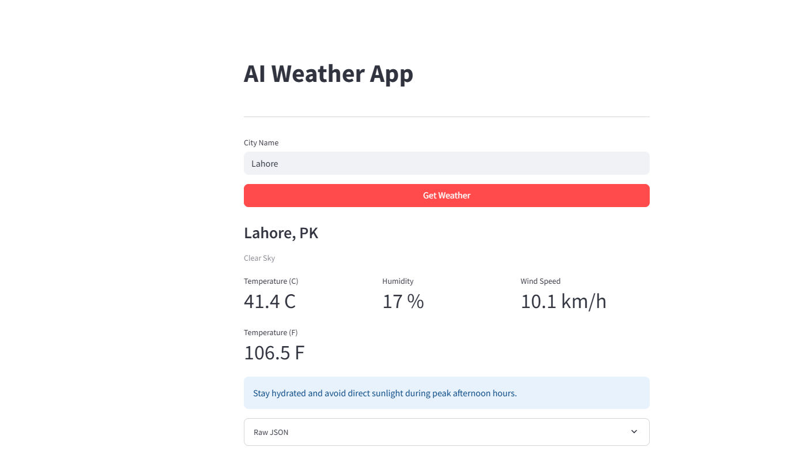

# AI Weather App

A Streamlit app that fetches real weather data and uses Google Gemini AI to display it with helpful advice.

## Features
- Fetches live weather from OpenWeatherMap API
- Formats weather data using Gemini AI
- Clean, responsive UI with metrics display
- Error handling and logging

## Tech Stack
- **Streamlit** - UI framework
- **OpenWeatherMap API** - Real weather data
- **Google Gemini AI** - Data formatting & advice generation

## How to Use
- Enter both API keys in the sidebar
- Type a city name
- Click "Get Weather"
- View formatted weather data with AI advice
  
## Deployment

